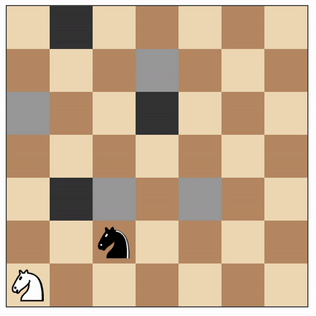

#Project description
This document is a description of three custom heuristics developed for AI game-playing agent for Isolation game. The idea of the game is shown on a pic below. Two chess rooks are moving on a 7x7 board trying to lock each other. Game idea and rules are fully explained in the short  [_video_](https://www.youtube.com/watch?v=i8z3-fn4wDM)

#Problem introduction and requirements

Project goal is to develop a heuristic that is better, at least on average, than AB_improved strategy developed by Udacity, more details available in the original [_project repository_](https://github.com/udacity/AIND-Isolation). Heuristics are used in evaluation procedure during each AI move giving numerical expression that is used to compare available moves thus allowing to develop AI game playing strategy.
Heuristics quality evaluated by running a tournament with 10 rounds against 7 opponents with different behaviour and random first move.
All user-developed heuristics must also comply with 150 ms per move computation time limit.

#Heuristics comparison

Among various strategies tested following three showed satisfactory benchmarks against AB_improved Udacity strategy:

* 'Aggressive start' (custom_score_3). Tends to minimize the No of opponent's moves during first seven moves, then tends to maximize No of own moves, showing rather defensive behaviour. This is an enhanced version of the (also pretty effective) maximizing difference between available own and opponent moves. During first seven moves strategy gives more weight (1.3 weight coefficient, to be exact) to opponent's freedom of move thus trying to minimize No of moves that is available to the opponent and then switches to defensive strategy (by penalizing opponent freedom with 0.7 weight coefficient).
Exact values of weight coefficints and No of moves for strategy switch are model parameters and a subject for tuning. Parameter selection shown above gave same mean win ratio of about 71% as AB_improved during six test tournaments but with wider variance (61% - 77% for Aggressive start versus 65% - 75% for AB_improved).
* 'Max own freedom enhanced' (custom_score_2). Selects the move that provides maximum number of available own moves plus the ratio between own and opponent moves (increased by 0.01 to avoid zero division). This strategy tries to maximize AI player freedom and also gives some preference to moves that significantly limit opponent's flexibility. It also acts like a 'killer' strategy when there is a move that allows to lock the opponent in next turn.
There is no tuning parameters for this strategy. Max own freedom enhanced (MOFE) showed almost the same mean for win ratio of 71.5% as AB_improved during six test tournaments with wider variance (63% - 76% for MOFE versus 65%-75% for AB_improved).
* 'MOFE with tight start', or 'MOFE enhanced' (custom_score). This strategy was selected as the best so far. This strategy forces the agent to select moves as close to opponent as possible during the first six turns and applies MOFE afterwards. Chasing during first several turns gives some possibility of locking the opponent in some area with few 'escape routes' potentially giving the preference during later game stages when move freedom is more valuable.
The only tuning parameter for this heuristic is No of moves before strategy switch. 'MOFE enhanced' beat AB_improved in 4 of 6 test tournaments by several percent points. Best result is shown in a table below. Mean win rate for 'MOFE enhanced' was about 73% with slightly more variance than for AB_improved (64% - 77% for MOFE enhanced versus 65%-75% for AB_improved).

\begin{center}
\textbf{Matches Results}
\end{center}

| Match #     | Opponent   |AB_Improved   | AB_Custom  |AB_Custom_2   | AB_Custom_3  |
|---|---|---|---|---|---|
|   |   | Won  / Lost  | Won / Lost  | Won / Lost  | Won / Lost  |
|1   |Random   |10  / 0   |8  / 2   | 10  / 0  | 10   / 0  |
|2   |MM_Open   | 5 / 5  |6 / 4   | 8 / 2  |8 / 2   |
|3   |MM_Center   | 9 / 1  |8 / 2   | 9 / 1  |9 / 1   |
|4   |MM_Improved   | 5 / 5  |9 / 1   |8 / 2   |7 / 3   |
|5   |AB_Open   | 3 / 7  |8 / 2   |7 / 3   |6 / 4   |
|6   |AB_Center   |6 / 4   |6 / 4   |8 / 2   |3 / 7   |
|7   |AB_Improved   |8 / 2   |9 / 1   |6 / 4   |3 / 7   |
|---|---|---|---|---|---|
|   |Win Rate:   |65.7%   |77.1%   |80.0%   |65.7%   |

#Summary

All user heuristics described in a document are relatively simple due to computation efficiency requirement resultant from 150 ms per move time limit. Though this limit is processor speed dependant, choice for more simplicity were made to provide results reproducibility with the condition of unavailable preliminary information for reviewers computer power.

'MOFE enhanced' strategy could be, at least slightly, improved further by avoiding corners during the first stage but this comes for a price of probable timeout warnings.